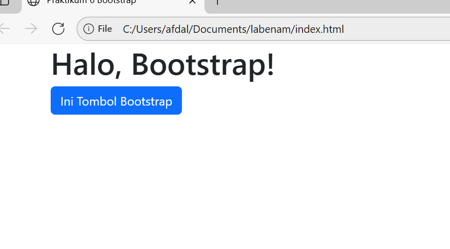
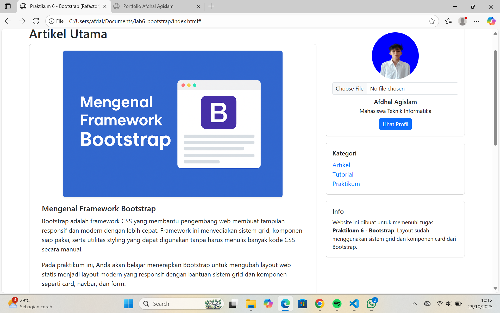
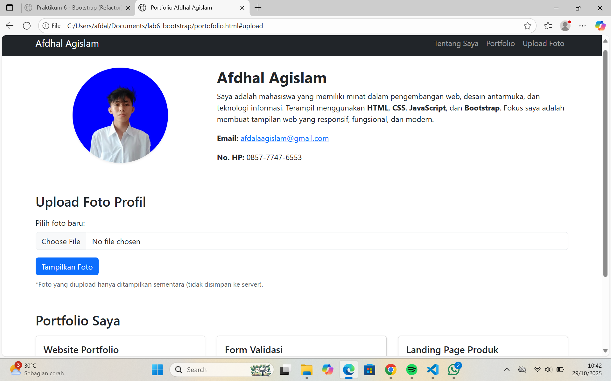

#  Praktikum 6 - Twitter Bootstrap  
**Nama:** Afdhal Agislam  
**NIM:** 312410445  
**Kelas:** Teknik Informatika  
**Mata Kuliah:** Pemrograman Web  

---

##  Tujuan Praktikum
1. Memahami dan menerapkan **Bootstrap Framework** untuk membuat tampilan web yang menarik, rapi, dan responsif.  
2. Melakukan **refactor (penyusunan ulang)** layout web dari praktikum sebelumnya agar menggunakan sistem grid Bootstrap.  
3. Memanfaatkan **komponen Bootstrap** seperti navbar, card, form, dan button untuk menggantikan elemen HTML biasa.  
4. Membuat halaman **Portfolio pribadi** sebagai implementasi nyata penggunaan Bootstrap pada proyek web.

---

##  Langkah-Langkah Praktikum

### 1️⃣ Refactor Layout Praktikum 4
**Tujuan:**  
Mengubah layout HTML lama menjadi layout Bootstrap dengan sistem grid dan komponen modern.

**Langkah-langkah:**  
- Tambahkan link CDN Bootstrap ke dalam `<head>`.  
- Ganti struktur layout dengan class Bootstrap:  
  - Gunakan `.container` untuk membungkus seluruh konten.  
  - Gunakan `.row` untuk baris dan `.col-md-8` serta `.col-md-4` untuk dua kolom utama.  
- Tambahkan `<nav class="navbar">` untuk navigasi.  
- Ganti `div.widget-box` dan `div.box` menjadi `<div class="card">`.  
- Hapus semua CSS manual seperti `float`, `clear`, `width`, dan `margin`.

**Hasil Akhir:**  
Layout lebih bersih, proporsional, dan otomatis responsif saat ukuran layar berubah.

---

### 2️⃣ Refactor Form Praktikum 5
**Tujuan:**  
Membuat tampilan form lebih rapi dan konsisten dengan gaya Bootstrap.

**Langkah-langkah:**  
- Gunakan class `.form-label` untuk label input.  
- Gunakan `.form-control` untuk input teks dan `.form-select` untuk dropdown.  
- Gunakan `.btn` dan `.btn-success` atau `.btn-primary` untuk tombol.  
- Tambahkan sedikit JavaScript agar form menampilkan alert saat dikirim.

**Hasil Akhir:**  
Formulir tampil seragam, proporsional, dan terlihat profesional tanpa penambahan CSS manual.

---

### 3️⃣ Membuat Halaman Portfolio
**Tujuan:**  
Membuat halaman `portfolio.html` sebagai halaman profil pribadi dengan tampilan modern.

**Isi Halaman:**
- **Navbar:** Navigasi menuju bagian “Tentang Saya”, “Portfolio”, dan “Upload Foto”.
- **Tentang Saya:**  
  - Foto profil `afdal.png` tampil **bulat sempurna** (`border-radius: 50%; object-fit: cover`).  
  - Biodata, email, dan nomor HP disusun dalam layout dua kolom (`.row` dan `.col-md-*`).  
- **Upload Foto:**  
  - Fitur upload menggunakan JavaScript `FileReader()` untuk menampilkan gambar baru tanpa reload.  
- **Portfolio Saya:**  
  - 3 proyek ditampilkan dalam bentuk card responsif menggunakan `.col-md-4`.  
  - Gambar, judul, dan deskripsi singkat tiap proyek.

---

### 4️⃣ Menambahkan Gambar pada Artikel
**Tujuan:**  
Memperindah tampilan artikel utama dengan gambar ilustrasi `artikel.png`.

**Langkah-langkah:**
- Tambahkan elemen `` di dalam card artikel dengan `class="img-fluid mx-auto d-block"`.
- Tambahkan `style="max-width: 80%; border-radius: 10px; box-shadow: 0 4px 10px rgba(0,0,0,0.1);"`
- Hasilnya gambar menjadi proporsional dan elegan di atas judul artikel.

---


---

##  Konsep Dasar Bootstrap

### Tampilan Awal Bootstrap




###  Sistem Grid Bootstrap
Bootstrap menggunakan **Grid System 12 kolom** yang memudahkan pembagian layout.  
Contoh:

```html
<div class="row">
  <div class="col-md-8">Main Content</div>
  <div class="col-md-4">Sidebar</div>
</div>
```
**Grid ini otomatis menyesuaikan ukuran layar (responsive design).**

## Komponen Bootstrap yang Digunakan ##
| Komponen          | Fungsi                                                                     |
| ----------------- | -------------------------------------------------------------------------- |
| **Navbar**        | Navigasi utama di bagian atas halaman.                                     |
| **Card**          | Menampilkan konten dalam kotak rapi dengan shadow.                         |
| **Button**        | Tombol interaktif dengan berbagai warna tema.                              |
| **Form**          | Input teks, email, select, dan textarea responsif.                         |
| **Image Utility** | `img-fluid`, `rounded-circle`, `shadow-sm` untuk mengatur tampilan gambar. |

## JavaScript (Interaktivitas) ##

- Menggunakan FileReader() agar gambar yang diupload langsung tampil di halaman.
- Menggunakan event addEventListener('submit') pada form untuk menampilkan alert konfirmasi.

## Tampilan Akhir ##

### Halaman Index ###
- Artikel utama dengan gambar artikel.png

- Tiga fitur dalam card (Heading 3 Kolom)

- Formulir kontak (Refactor Praktikum 5)

- Sidebar berisi profil Afdhal Agislam dan kategori




## Halaman Portfolio ##
- Foto profil bulat sempurna (afdal.png)

- Biodata lengkap dan rapi

- Fitur upload foto dengan JavaScript

- Tiga card proyek (Portfolio Saya)




## Kesimpulan ##

Praktikum 6 ini memperkenalkan bagaimana Bootstrap membantu membuat web modern tanpa harus menulis banyak CSS manual.
Dengan memanfaatkan komponen siap pakai dan grid system, pengembang dapat:

- Membangun layout yang cepat, responsif, dan menarik.

- Menjaga konsistensi antar halaman web.

- Meningkatkan efisiensi waktu dalam proses pengembangan.

Hasil akhirnya adalah website Afdhal Agislam Portfolio yang responsif, interaktif, dan berpenampilan profesional.
